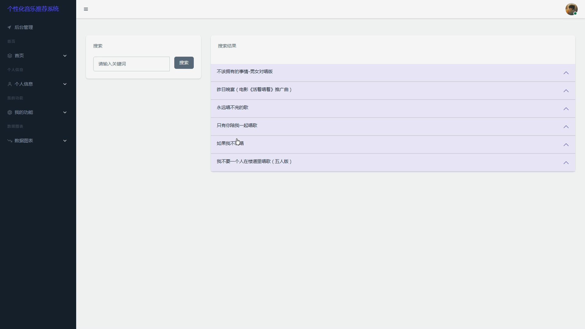

## 计算机毕业设计吊炸天Django+Tensorflow音乐推荐系统 音乐可视化 卷积神经网络CNN LSTM音乐情感分析 机器学习 深度学习 Flask 大

## 要求
### 源码有偿！一套(论文 PPT 源码+sql脚本+教程)

### 
### 加好友前帮忙start一下，并备注github有偿纯python音乐推荐系统
### 我的QQ号是2827724252或者798059319或者 1679232425或者微信:bysj2023nb

# 

### 加qq好友说明（被部分 网友整得心力交瘁）：
    1.加好友务必按照格式备注
    2.避免浪费各自的时间！
    3.当“客服”不容易，repo 主是体面人，不爆粗，性格好，文明人。
## 介绍
前端：html css vue.js echarts
后端：flask/django均可选装
数据库：mysql
爬虫：selenium
推荐算法：卷积神经网络CNN Tensorflow 协同过滤 SVD混合神经网络...
创新点：爬虫、可视化大屏、推荐算法、装杯虚拟机敲命令显摆吊打导师
近期会增加预测算法吊打导师
原创出山，地动山摇，一切抄袭者必须被我吊打致si !!!!
25届原创大数据毕设
## 演示视频
https://www.bilibili.com/video/BV1m9qUYDE2H
## 演示运行截图

